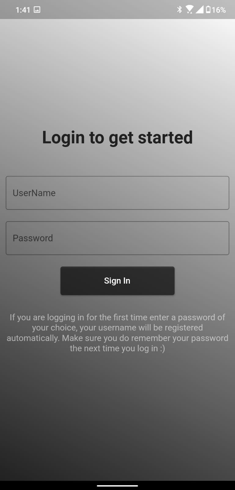
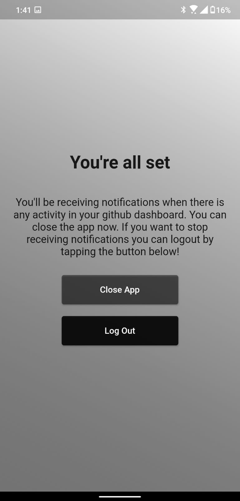

# GitNotify

### Get notified about the activities of your followings. :)

[Download the apk from here!](https://github.com/berakrishnendu36/gitNotify/releases/download/v1.0/app-release.apk)

The following events are currently being used to notify:-
 - WatchEvent (When a repo is starred)
 - CreateEvent (When a new repo is created)
 - ForkEvent (When a repo is forked)

Login with your gitHub username and a password of your choice. Your account gets automatically created.  

The app runs in the background occupying a tiny amount of your memory :) and notifies you about any activity in your dashboard within the past one hour.  

Once you logout of the app, all your data is lost from the server and none of your data (gitHub username and your device's firebase id) is retained. 

## Screenshots

  